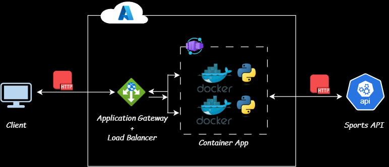

# 04_containerized_sports_api
Day 4: Building an API that gets us NFL Game Day schedule utilizing Azure services including Azure COntainer Apps, Application Gateway with Python



## Project Overview
This project implements a Game Day Notification Solution using Azure services. It leverages Azure Container Apps for running the application, Azure Application Gateway for load balancing, and Azure Private Endpoints for secure communication.

## Features
- Azure Container Apps (for running the containerized application)
- Azure Application Gateway (for load balancing)
- Azure Private Endpoints (for secure communication)
- Azure Private DNS Zones (for DNS resolution)
- Programming Language: Python 3.x
- Containerization: Docker

## Prerequisites
- An Azure account with sufficient permissions to create resources
- Docker installed locally for building and pushing the container image
- Azure CLI installed and configured
- SportsData API key

## Dependencies
- Flask
- requests
- python-dotenv

## Project Structure
```shell
04_containerized_sports_api/
├── app.py
├── Dockerfile
├── .gitignore
├── .env
├── requirements.txt
└── README.md
```

## steps
1. Clone the repository
  ```shell
    git clone git@github.com:Jekwulum/04_containerized_sports_api.git
    cd 04_containerized_sports_api
  ```
2. Login to Azure CLI
  ```shell
    az login
  ```
3. Create Azure Container Registry (ACR)
  ```shell
    az acr create --resource-group <ResourceGroupName> --name <ACRName> --sku Basic
  ```
4. Login to ACR
  ```shell
    az acr login --name <ACRName>
  ```
5. Build, and Push the Docker Image
  ```shell
    docker build -t <ACRName>.azurecr.io/sports-api .
    docker push <ACRName>.azurecr.io/sports-api:latest
    # when changes are made to the files, perform these two operations again
  ```
6. Deploy the Container App
    - Create a Container Apps Environment:
    - Create the Container App
    - Scale the Container App
7. Set Up Application Gateway
    - Create a Virtual Network (VNet)
    - Create the Application Gateway
8. Configure Private Endpoints
    - Create a Private Endpoint for the Container App
    - Create a Private DNS Zone
  
## Future Enhancements
- Implement rate limiting and throttling using API Management.

